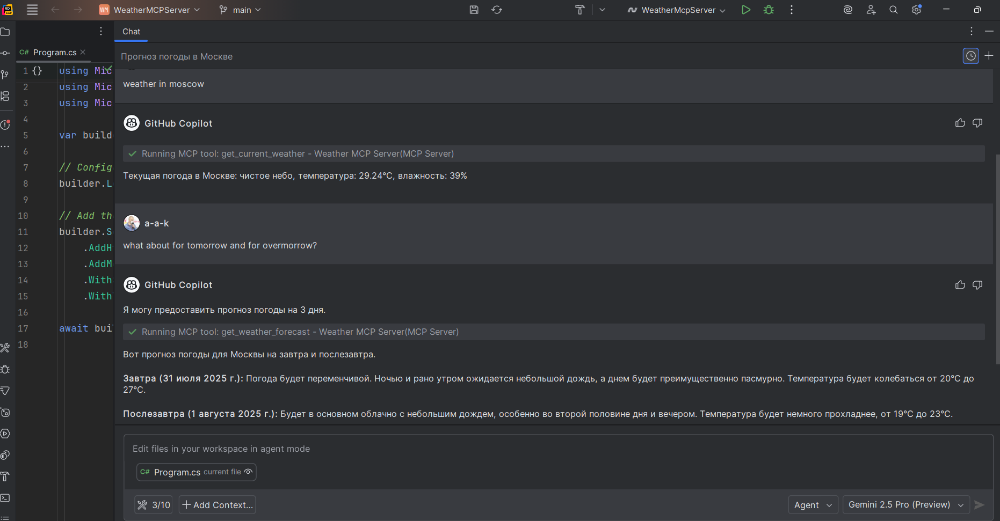

# Weather MCP Server

This project provides a simple yet powerful Model Context Protocol (MCP) server that exposes tools for retrieving weather information. It leverages the [OpenWeatherMap API](https://openweathermap.org/) to provide current weather conditions, 3-day forecasts, and simulated weather alerts.

## Architecture

The server is built using .NET 8 and follows modern architectural best practices. The core logic is separated into two main components:

- **`WeatherTools`**: This class defines the MCP tools that are exposed to the AI model. It is responsible for handling the tool requests and formatting the responses.
- **`OpenWeatherMapService`**: This service encapsulates all interactions with the OpenWeatherMap API. It is responsible for making the HTTP requests, handling API key authentication, and parsing the responses. This separation of concerns makes the code more modular, testable, and easier to maintain.

## Configuration

To use this server, you need an API key from OpenWeatherMap. The server is configured to read the API key from the `OPENWEATHER_API_KEY` environment variable.

### Setting the API Key

Before running the server, you must set the `OPENWEATHER_API_KEY` environment variable.

**On Linux/macOS:**
```bash
export OPENWEATHER_API_KEY=<your-openweathermap-api-key>
```

**On Windows:**
```powershell
$env:OPENWEATHER_API_KEY="<your-openweathermap-api-key>"
```

If the `OPENWEATHER_API_KEY` is not set, the server will throw an `InvalidOperationException` upon startup.

## Available Tools

The following tools are available:

- **`GetCurrentWeather`**: Retrieves the current weather conditions for a specified city.
  - **Parameters**: `city` (string, required), `countryCode` (string, optional)
  - **Example**: `GetCurrentWeather(city: "London", countryCode: "GB")`

- **`GetWeatherForecast`**: Provides a 3-day weather forecast for a specified city.
  - **Parameters**: `city` (string, required), `countryCode` (string, optional)
  - **Example**: `GetWeatherForecast(city: "Paris", countryCode: "FR")`

- **`GetWeatherAlerts`**: Fetches simulated weather alerts for a specified city.
  - **Parameters**: `city` (string, required), `countryCode` (string, optional)
  - **Example**: `GetWeatherAlerts(city: "Tokyo", countryCode: "JP")`
  - **Note**: This is a simulated implementation using the hourly forecast endpoint due to API key limitations.

## Development

### Building the Project
To build the project, run the following command from the root directory:
```bash
dotnet build
```

### Running Tests
The project includes both unit and integration tests. To run the tests, use the following command:
```bash
dotnet test
```
**Note**: The integration tests require a valid `OPENWEATHER_API_KEY` to be set. Tests that require the API key will be skipped if it's not available. The test suite also includes a test that verifies that the application throws an exception if the API key is not found.

## Usage with MCP

To use this server with an MCP-compatible client, you can configure your IDE to run the project directly. For example, in VS Code, you can create a `.vscode/mcp.json` file with the following content:

```json
{
  "servers": {
    "Weather MCP Server": {
      "type": "stdio",
      "command": "dotnet",
      "args": [
        "run",
        "--project",
        "<path-to-your-project>/WeatherMcpServer/WeatherMcpServer.csproj"
      ]
    }
  }
}
```
or

```json
{
  "servers": {
    "Weather MCP Server": {
      "type": "stdio",
      "command": "dotnet",
      "args": [
        "<path-to-your-project>/WeatherMcpServer/bin/<Debug> or <Release>/<net*>/WeatherMcpServer.dll"
      ]
    }
  }
}
```
Optionally, you can provide `env` or/and `workingDirectory` parameters this way:

```json
{
  "servers": {
    "Weather MCP Server": {
      "type": "stdio",
      "command": "dotnet",
      "args": [
        "<path-to-your-project>/WeatherMCPServer/WeatherMcpServer/bin/Debug/net8.0/WeatherMcpServer.dll"
      ],
      "env": {
        "OPENWEATHER_API_KEY": "<your_key>"
      },
      "workingDirectory": "<path-to-your-project>/WeatherMCPServer/WeatherMcpServer/bin/Debug/net8.0"
    }
  }
}
```

## Here is the results of GitHub Copilot communicating with this MCP server



## Publishing to NuGet.org

To package the server for distribution on NuGet.org, run the following command:

```bash
dotnet pack -c Release
```

Then, you can publish the generated NuGet package using the `dotnet nuget push` command.

For more information on MCP, please refer to the [official documentation](https://modelcontextprotocol.io/).

---
*This solution was implemented leveraging OpenAI's Codex and Google's Jules tools.*
